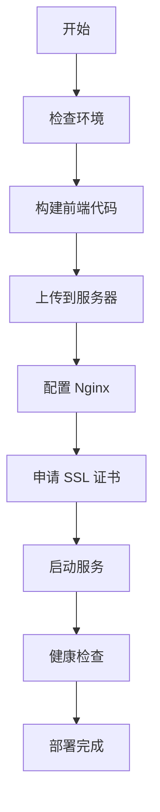
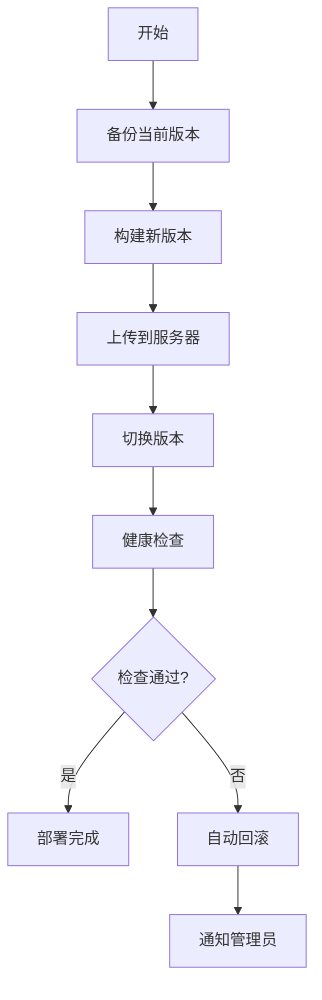

# Web Deployer Skill

## 功能描述

全自动化的 Web 应用部署工具，支持：
- 前端代码构建（Vue/React/Next.js）
- 服务器部署（通过 SSH）
- Nginx 配置自动生成
- SSL 证书申请和续期（Let's Encrypt）
- 部署回滚
- 健康检查

## 使用场景

1. **首次部署**：从零开始部署 Web 应用
2. **更新部署**：发布新版本
3. **回滚部署**：回退到上一版本
4. **配置更新**：更新 Nginx 配置或 SSL 证书

## CLI 命令

```bash
# 首次部署
fishing-cli deploy init \
  --project-path ./frontend \
  --domain qianyu.iepose.cn \
  --server user@server-ip

# 部署更新
fishing-cli deploy update \
  --project-path ./frontend \
  --build-command "npm run build"

# 回滚到上一版本
fishing-cli deploy rollback

# 查看部署状态
fishing-cli deploy status

# 配置 SSL 证书
fishing-cli deploy ssl \
  --domain qianyu.iepose.cn \
  --email admin@qianyu.com

# 更新 Nginx 配置
fishing-cli deploy nginx \
  --config ./nginx.conf
```

## MCP 工具

### 1. deploy_init
首次部署 Web 应用

**参数**：
- `project_path` (string): 项目路径
- `domain` (string): 域名
- `server_host` (string): 服务器地址
- `server_user` (string): SSH 用户名
- `build_command` (string, optional): 构建命令
- `dist_dir` (string, optional): 构建输出目录

**返回**：
```json
{
  "success": true,
  "data": {
    "deployment_id": "deploy_20260311_001",
    "status": "deployed",
    "url": "https://qianyu.iepose.cn",
    "build_time": "2m 34s",
    "deploy_time": "45s"
  }
}
```

### 2. deploy_update
更新部署

**参数**：
- `project_path` (string): 项目路径
- `build_command` (string, optional): 构建命令
- `skip_build` (boolean, optional): 跳过构建

**返回**：
```json
{
  "success": true,
  "data": {
    "deployment_id": "deploy_20260311_002",
    "previous_version": "deploy_20260311_001",
    "status": "deployed",
    "changes": ["更新首页", "修复 bug"]
  }
}
```

### 3. deploy_rollback
回滚部署

**参数**：
- `version` (string, optional): 回滚到指定版本（默认上一版本）

**返回**：
```json
{
  "success": true,
  "data": {
    "current_version": "deploy_20260311_001",
    "previous_version": "deploy_20260311_002",
    "status": "rolled_back"
  }
}
```

### 4. deploy_status
查看部署状态

**返回**：
```json
{
  "success": true,
  "data": {
    "current_version": "deploy_20260311_002",
    "deployed_at": "2026-03-11 10:30:00",
    "url": "https://qianyu.iepose.cn",
    "health_status": "healthy",
    "ssl_status": "valid",
    "ssl_expires": "2026-06-11"
  }
}
```

### 5. configure_ssl
配置 SSL 证书

**参数**：
- `domain` (string): 域名
- `email` (string): 邮箱（用于 Let's Encrypt）
- `force_renew` (boolean, optional): 强制续期

**返回**：
```json
{
  "success": true,
  "data": {
    "domain": "qianyu.iepose.cn",
    "status": "configured",
    "expires": "2026-06-11",
    "issuer": "Let's Encrypt"
  }
}
```

### 6. configure_nginx
配置 Nginx

**参数**：
- `config_content` (string, optional): 配置内容
- `config_file` (string, optional): 配置文件路径
- `reload` (boolean, optional): 是否重载 Nginx

**返回**：
```json
{
  "success": true,
  "data": {
    "status": "configured",
    "config_path": "/etc/nginx/sites-available/qianyu",
    "reloaded": true
  }
}
```

## 部署流程

### 首次部署流程


### 更新部署流程


## 配置文件

### deploy.yaml
```yaml
# 部署配置
project:
  name: "千鱼千寻"
  type: "vue"  # vue | react | nextjs
  build_command: "npm run build"
  dist_dir: "dist"

server:
  host: "${DEPLOY_SERVER_HOST}"
  user: "${DEPLOY_SERVER_USER}"
  port: 22
  ssh_key: "${DEPLOY_SSH_KEY}"
  deploy_path: "/var/www/qianyu"

domain:
  primary: "qianyu.iepose.cn"
  aliases:
    - "www.qianyu.iepose.cn"

ssl:
  enabled: true
  email: "admin@qianyu.com"
  auto_renew: true

nginx:
  template: "default"
  custom_config: |
    # 自定义 Nginx 配置
    client_max_body_size 10M;

backup:
  enabled: true
  keep_versions: 5

health_check:
  enabled: true
  url: "https://qianyu.iepose.cn/health"
  timeout: 10
  retries: 3
```

## 环境变量

```env
# 服务器配置
DEPLOY_SERVER_HOST=your-server-ip
DEPLOY_SERVER_USER=root
DEPLOY_SSH_KEY=/path/to/ssh/key

# 域名配置
DEPLOY_DOMAIN=qianyu.iepose.cn
DEPLOY_SSL_EMAIL=admin@qianyu.com

# 部署路径
DEPLOY_PATH=/var/www/qianyu

# Nginx 配置
NGINX_CONFIG_PATH=/etc/nginx/sites-available
```

## 使用示例

### 示例 1：首次部署 Vue 应用
```bash
# 1. 配置环境变量
export DEPLOY_SERVER_HOST=123.45.67.89
export DEPLOY_SERVER_USER=root
export DEPLOY_SSH_KEY=~/.ssh/id_rsa

# 2. 初始化部署
fishing-cli deploy init \
  --project-path ./frontend \
  --domain qianyu.iepose.cn \
  --server root@123.45.67.89 \
  --build-command "npm run build" \
  --dist-dir "dist"

# 3. 配置 SSL
fishing-cli deploy ssl \
  --domain qianyu.iepose.cn \
  --email admin@qianyu.com
```

### 示例 2：更新部署
```bash
# 1. 拉取最新代码
cd frontend
git pull origin main

# 2. 部署更新
fishing-cli deploy update \
  --project-path . \
  --build-command "npm run build"

# 3. 检查状态
fishing-cli deploy status
```

### 示例 3：回滚部署
```bash
# 回滚到上一版本
fishing-cli deploy rollback

# 回滚到指定版本
fishing-cli deploy rollback --version deploy_20260310_005
```

## 自动化部署（通过 OpenClaw）

### 飞书命令
```
/deploy web                    # 部署 Web 应用
/deploy status                 # 查看部署状态
/deploy rollback               # 回滚到上一版本
/deploy ssl renew              # 续期 SSL 证书
```

### 定时任务
```yaml
# openclaw.yaml
cron_jobs:
  # 每天检查 SSL 证书
  - name: "ssl_check"
    schedule: "0 0 * * *"
    agent: "web-deployer"
    action: "check_ssl_expiry"

  # 每周备份部署文件
  - name: "deploy_backup"
    schedule: "0 2 * * 0"
    agent: "web-deployer"
    action: "backup_deployment"
```

## 安全注意事项

1. **SSH 密钥**：使用密钥认证，不要使用密码
2. **权限控制**：部署用户只有必要的权限
3. **备份策略**：保留最近 5 个版本
4. **健康检查**：部署后自动检查服务状态
5. **回滚机制**：失败自动回滚

## 故障排查

### 部署失败
```bash
# 查看部署日志
fishing-cli deploy logs

# 检查服务器连接
fishing-cli deploy test-connection

# 手动回滚
fishing-cli deploy rollback
```

### SSL 证书问题
```bash
# 检查证书状态
fishing-cli deploy ssl status

# 强制续期
fishing-cli deploy ssl renew --force

# 查看证书详情
fishing-cli deploy ssl info
```

### Nginx 配置问题
```bash
# 测试配置
fishing-cli deploy nginx test

# 重载配置
fishing-cli deploy nginx reload

# 查看错误日志
fishing-cli deploy nginx logs
```

## 技术实现

### 核心技术
- **SSH 连接**：paramiko
- **文件传输**：rsync / scp
- **构建工具**：npm / yarn / pnpm
- **SSL 证书**：certbot (Let's Encrypt)
- **Web 服务器**：Nginx

### 部署架构
```
本地开发环境
    ↓ (git push)
GitHub/GitLab
    ↓ (webhook / 手动触发)
OpenClaw web-deployer
    ↓ (SSH + rsync)
生产服务器
    ↓
Nginx → 用户
```

## 扩展功能

### 支持的前端框架
- ✅ Vue 2/3
- ✅ React
- ✅ Next.js
- ✅ Nuxt.js
- ✅ 静态 HTML

### 支持的部署方式
- ✅ SSH + rsync
- ✅ Docker 容器
- ✅ FTP/SFTP
- ✅ 对象存储（OSS/S3）

### 支持的 CI/CD
- ✅ GitHub Actions
- ✅ GitLab CI
- ✅ Jenkins
- ✅ 手动触发

## 性能指标

- 构建时间：< 5 分钟
- 部署时间：< 1 分钟
- 回滚时间：< 30 秒
- SSL 配置：< 2 分钟
- 健康检查：< 10 秒

## 注意事项

1. 首次部署需要配置服务器环境
2. 确保域名已正确解析到服务器
3. SSL 证书申请需要域名可访问
4. 部署前建议先在测试环境验证
5. 重要更新建议先备份数据库
